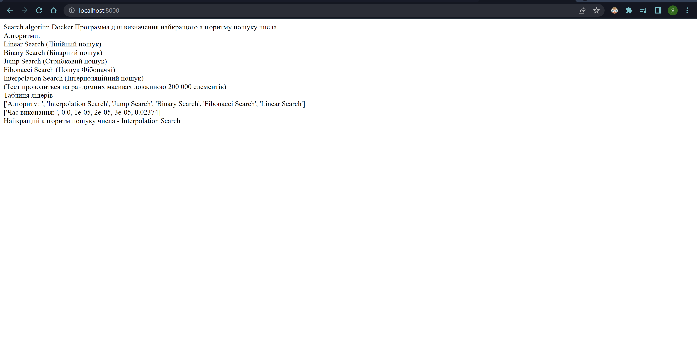

# ___Настройка докера за допомогою файла "docker-compose.yml"___
***
## 1. Встановлення Docker Desktop
Для початку встановлюємо "Docker Desktop" [із офіційного сайту](https://docs.docker.com/desktop/windows/install/) після чого вікриваємо його та залишаємо відкритим у продовж усього часу щоб працювати із ним
***
## 2. Основна программа
створюємо файл із основною программою:
> module.py

У даному файлі у нас порівняння найпопулярніших алгоритмів пошуку числа у списках, збираємо всі виводи у функцію main та добавляємо теги "br" для хорошого виводу, після чого створюємо файл:
>app.py

У якому робимо просту программу на Flask та повертаємо текст із функції main файла module.py
```python
import time
import module
import redis
from flask import Flask
app = Flask(__name__)
cache = redis.Redis(host="redis", port=6379)

def get_hit_count():
    retries = 5
    while True:
        try:
            return cache.incr("hits")
        except redis.exceptions.ConnectionError as exc:
            if retries == 0:
                raise exc
            retries -= 1
            time.sleep(0.5)

@app.route("/")
def hello():
    #count = get_hit_count()
    text = module.main()
    return "Search algoritm Docker {} \n".format(text)
```
***
## 3. Настройка проекту для Docker
Завдяки віртуальному середовищі у python створюємо файл 
> requirements.txt

командою:
> pip freeze > requirements.txt

на виході отримуємо усі необхідні бібліотеки для запуску коду

```r
async-timeout==4.0.2
autopep8==1.6.0
click==8.1.3
colorama==0.4.5
commonmark==0.9.1
Deprecated==1.2.13
Flask==2.1.2
itsdangerous==2.1.2
Jinja2==3.1.2
MarkupSafe==2.1.1
packaging==21.3
pycodestyle==2.8.0
Pygments==2.12.0
pyparsing==3.0.9
redis==4.3.3
rich==12.4.1
tabulate==0.8.9
toml==0.10.2
Werkzeug==2.1.2
wrapt==1.14.1
```
***
## 4. Docker
Створюємо "dockerfile" у який прописуємо наступний код:
```docker
# syntax=docker/dockerfile:1
FROM python:3.7-alpine
WORKDIR /code
ENV FLASK_APP=app.py
ENV FLASK_RUN_HOST=0.0.0.0
RUN apk add --no-cache gcc musl-dev linux-headers
COPY requirements.txt requirements.txt
RUN pip install -r requirements.txt
EXPOSE 5000
COPY . .
CMD ["flask", "run"]
```
Та створюємо файл "docker-compose.yml" у якому прописуємо наступну конфігурацію:
```yml
version: "3.9"
services:
  web:
    build: .
    ports:
      - "8000:5000"
    volumes:
      - .:/code
    environment:
      FLASK_ENV: development
  redis:
    image: "redis:alpine"
```
***
## 5. Запуск программи
Створюємо та запускаємо контейнер командою:
> docker-compose up

Получаємо наступний вивід:
```d
Creating network "docker-compose_config_default" with the default driver
Building web
[+] Building 15.3s (15/15) FINISHED
 => [internal] load build definition from Dockerfile                                                                                                   0.0s 
 => => transferring dockerfile: 329B                                                                                                                   0.0s 
 => [internal] load .dockerignore                                                                                                                      0.1s 
 => => transferring context: 2B                                                                                                                        0.0s 
 => resolve image config for docker.io/docker/dockerfile:1                                                                                             3.2s 
 => CACHED docker-image://docker.io/docker/dockerfile:1@sha256:443aab4ca21183e069e7d8b2dc68006594f40bddf1b15bbd83f5137bd93e80e2                        0.0s 
 => [internal] load build definition from Dockerfile                                                                                                   0.0s 
 => [internal] load .dockerignore                                                                                                                      0.0s 
 => [internal] load metadata for docker.io/library/python:3.7-alpine                                                                                   1.3s 
 => [1/6] FROM docker.io/library/python:3.7-alpine@sha256:a03bd8ebf621e25cc51ee80cb82d04ca5e5cff7eed63e735772a41a709eaa8a9                             0.0s 
 => [internal] load build context                                                                                                                      8.6s 
 => => transferring context: 34.96MB                                                                                                                   8.5s 
 => CACHED [2/6] WORKDIR /code                                                                                                                         0.0s 
 => CACHED [3/6] RUN apk add --no-cache gcc musl-dev linux-headers                                                                                     0.0s 
 => CACHED [4/6] COPY requirements.txt requirements.txt                                                                                                0.0s 
 => CACHED [5/6] RUN pip install -r requirements.txt                                                                                                   0.0s 
 => [6/6] COPY . .                                                                                                                                     0.7s 
 => exporting to image                                                                                                                                 0.7s 
 => => exporting layers                                                                                                                                0.6s 
 => => writing image sha256:af5d1c2726e9d1f2026377bbc356d3681dbc90ec6dde50c961bd7bc67099dc35                                                           0.0s 
 => => naming to docker.io/library/docker-compose_config_web                                                                                           0.0s 

Use 'docker scan' to run Snyk tests against images to find vulnerabilities and learn how to fix them
WARNING: Image for service web was built because it did not already exist. To rebuild this image you must use `docker-compose build` or `docker-compose up --build`.
Pulling redis (redis:alpine)...
alpine: Pulling from library/redis
2408cc74d12b: Already exists
e90389148883: Pull complete
c6c08b6ea4d5: Pull complete
a1a4b4673a23: Pull complete
e14aa32bdd63: Pull complete
abe61b7e68d2: Pull complete
Digest: sha256:5916c280afae05baf0dc9a0cc82fa8e51477bdbfc72f60a5c14fd2b7735bcf07
Status: Downloaded newer image for redis:alpine
Creating docker-compose_config_web_1   ... done
Creating docker-compose_config_redis_1 ... done
Attaching to docker-compose_config_web_1, docker-compose_config_redis_1
redis_1  | 1:C 24 Jun 2022 10:45:51.375 # oO0OoO0OoO0Oo Redis is starting oO0OoO0OoO0Oo
redis_1  | 1:C 24 Jun 2022 10:45:51.375 # Redis version=7.0.2, bits=64, commit=00000000, modified=0, pid=1, just started
redis_1  | 1:C 24 Jun 2022 10:45:51.375 # Warning: no config file specified, using the default config. In order to specify a config file use redis-server /path/to/redis.conf
redis_1  | 1:M 24 Jun 2022 10:45:51.376 * monotonic clock: POSIX clock_gettime
redis_1  | 1:M 24 Jun 2022 10:45:51.378 * Running mode=standalone, port=6379.
redis_1  | 1:M 24 Jun 2022 10:45:51.378 # Server initialized
redis_1  | 1:M 24 Jun 2022 10:45:51.379 * Ready to accept connections
web_1    |  * Serving Flask app 'app.py' (lazy loading)
web_1    |  * Environment: development
web_1    |  * Debug mode: on
web_1    |  * Running on all addresses (0.0.0.0)
web_1    |    WARNING: This is a development server. Do not use it in a production deployment.
web_1    |  * Running on http://127.0.0.1:5000
web_1    |  * Running on http://172.18.0.3:5000 (Press CTRL+C to quit)
web_1    |  * Restarting with stat
web_1    |  * Debugger is active!
web_1    |  * Debugger PIN: 701-793-597
```

Заходимо на http://localhost:8000/ та бачимо результат виконання программи:

***
## 6. Експеременти із Docker
Запускаємо программу у фоновому режимі за допомогою флажка "-d"
> docker-compose up -d

Вивід:
```do
docker-compose_config_web_1 is up-to-date
docker-compose_config_redis_1 is up-to-date
```

Перевірка:
>docker-compose ps

Вивід:
```
            Name                           Command               State           Ports
            Name                           Command               State           Ports
-----------------------------------------------------------------------------------------------
docker-compose_config_redis_1   docker-entrypoint.sh redis ...   Up      6379/tcp
docker-compose_config_web_1     flask run                        Up      0.0.0.0:8000->5000/tcp
```
Дізнаємося які змінні середовища доступні для web служби:
>docker-compose run web env

Вивід:
```d
Creating docker-compose_config_web_run ... done
PATH=/usr/local/bin:/usr/local/sbin:/usr/local/bin:/usr/sbin:/usr/bin:/sbin:/bin
HOSTNAME=871e6f05feca
TERM=xterm
FLASK_ENV=development
LANG=C.UTF-8
GPG_KEY=0D96DF4D4110E5C43FBFB17F2D347EA6AA65421D
PYTHON_VERSION=3.7.13
PYTHON_PIP_VERSION=22.0.4
PYTHON_SETUPTOOLS_VERSION=57.5.0
PYTHON_GET_PIP_URL=https://github.com/pypa/get-pip/raw/6ce3639da143c5d79b44f94b04080abf2531fd6e/public/get-pip.py
PYTHON_GET_PIP_SHA256=ba3ab8267d91fd41c58dbce08f76db99f747f716d85ce1865813842bb035524d
FLASK_APP=app.py
FLASK_RUN_HOST=0.0.0.0
HOME=/root
```
Якщо ми почали Compose за допомогою docker-compose up -d, зупиняємо свої служби:
> docker-compose stop

Вивід:
```do
Stopping docker-compose_config_web_1   ... done
Stopping docker-compose_config_redis_1 ... done
```
Ми можемо збити все, повністю видаливши контейнери, за допомогою "down" команди. Перейдемо у "--volumes", щоб також видалити обсяг даних, який використовує контейнер Redis:
>docker-compose down --volumes

Вивід:
```do
Removing docker-compose_config_web_run_88079dff0917 ... done
Removing docker-compose_config_web_1                ... done
Removing docker-compose_config_redis_1              ... done
Removing network docker-compose_config_default
```
***